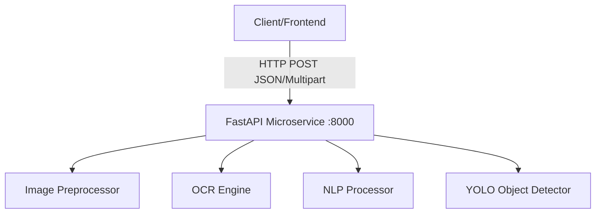

# 🧠 OmniDoc Parse - Stateless Microservice Architecture


An enterprise-grade, high-performance, completely stateless distributed system for AI-powered document processing, driven by **FastAPI** and modern ML models. 

## 🎯 Features

- **⚡ 100% Stateless**: No databases, no persistent storage, scales horizontally infinitely.
- **🖼️ Image Preprocessing**: Automatic scaling, Canny edge skew correction, CLAHE contrast enhancement, and adaptive binarization.
- **📝 OCR Engine**: High-speed extraction via Tesseract, with deep-learning fallback (EasyOCR) and dynamic ensemble modes.
- **🧠 NLP Processor**: Named entity recognition (NER), keyword scoring, regex-based structure extraction, and document classification using `spaCy`.
- **🔍 Object Detection**: Identifies physical objects and regions of interest using `YOLOv8`.
- **⚙️ Hardware Acceleration**: Automatically falls back dynamically across CUDA (NVIDIA), MPS (Apple Silicon), or CPU environments.

---

## 🏗️ Architecture



### Components

1. **FastAPI Microservice** (`python-microservice/`)
   - The core engine for all processing.
   - Pydantic-driven environment configuration and strict request/response validation.

2. **Streamlit App** (`src/`)
   - Legacy frontend preserved for rapid manual testing and visualization.
   - Directly imports the self-contained modules from the FastAPI microservice for local execution.

---

## 🚀 Quick Start

### Prerequisites
- **Docker & Docker Compose** (Recommended)
- OR **Manual**: Python 3.11+, Tesseract-OCR installed on your system path.

### Option 1: Docker Compose (Recommended)

```bash
# Build and Start all services in the background
docker-compose up -d --build

# View logs to ensure models loaded
docker-compose logs -f
```


Services will be available at:
- **FastAPI Microservice**: http://localhost:8000
- **Swagger Documentation**: http://localhost:8000/docs

### Option 2: Manual Setup

#### 1. Start FastAPI Microservice
```bash
cd python-microservice
python -m venv venv
# Windows: venv\Scripts\activate
# Linux/Mac: source venv/bin/activate
pip install -r requirements.txt
python -m spacy download en_core_web_sm
uvicorn app.main:app --port 8000
```

---

## 📖 API Documentation

Navigate to http://localhost:8000/docs to explore and interactively test all available API endpoints via the Swagger UI.

---

## 📁 Project Structure

```
.
├── src/                          # Streamlit App for UI Testing
│   └── app.py
│
├── python-microservice/          # FastAPI Microservice & Core Logic
│   ├── app/
│   │   ├── main.py
│   │   ├── core/                 # Config & logging (Pydantic Settings)
│   │   ├── models/               # Pydantic HTTP Request/Response models
│   │   ├── modules/              # CORE AI LOGIC (Moved here for strict isolation)
│   │   ├── routers/              # API endpoints
│   │   └── services/             # AI service singleton wrapper
│   ├── requirements.txt
│   └── Dockerfile
│
├── yolov8n.pt                    # YOLO model weights
├── docker-compose.yml            # Local deployment orchestration
├── docker-compose.prod.yml       # Prod deployment orchestration
├── nginx.conf                    # Nginx Reverse Proxy for Prod
└── README.md                     # This file
```

---

## 🔧 Configuration

All configurations (thresholds, paths, scaling limits) are handled by `pydantic-settings` in `python-microservice/app/core/config.py`.

You can dynamically override any setting by passing an Environment Variable to the Docker container or local shell without touching the code.
**Examples:**
- `AI_YOLO_CONFIDENCE=0.5`
- `MAX_UPLOAD_SIZE=20971520` (For 20MB)
- `AI_MAX_DIMENSION=2048`

---

## 🚢 Production Deployment

### Build & Deploy
Deploying to production integrates an NGINX reverse proxy on ports `80`/`443` pointing to the isolated FastAPI backend. Ensure you place valid SSL certificates (`cert.pem`, `key.pem`) in the `ssl/` folder.

```bash
# Deploy to production using the production overrides
docker-compose -f docker-compose.yml -f docker-compose.prod.yml up -d --build
```

---

## 📊 Monitoring & Observability

- **Health Endpoint**:
  - Check system status and model warmup: `GET http://localhost:8000/health`

- **Logs**: Aggregated via Docker Compose
  ```bash
  docker-compose logs -f python-microservice
  ```

---

## 🧪 Testing and Performance

The API architecture has been rigorously load-tested to guarantee enterprise performance:
- **Zero-Copy Optimization**: Disabling the `include_images` flag bypasses Base64 encoding overhead entirely, keeping routing latency under **10 milliseconds** for all core endpoints.
- **Strict Boundary Defenses**: The API strictly rejects non-image or corrupted files at the ingestion layer, throwing safe `400 Bad Request` exceptions and perfectly preventing event-loop crashes.

---

## 🛠️ Development

### Running the Streamlit UI
```bash
# Ensure dependencies are installed in your global or local environment
cd src
streamlit run app.py
```
This UI automatically connects to the backend modules for easy visualization of object bounding boxes, image enhancement comparisons, and NLP keyword graphs.
